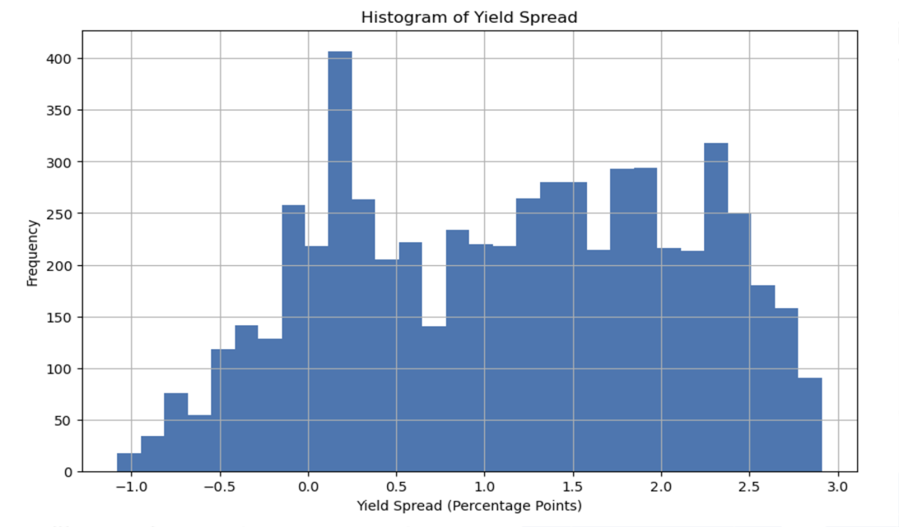
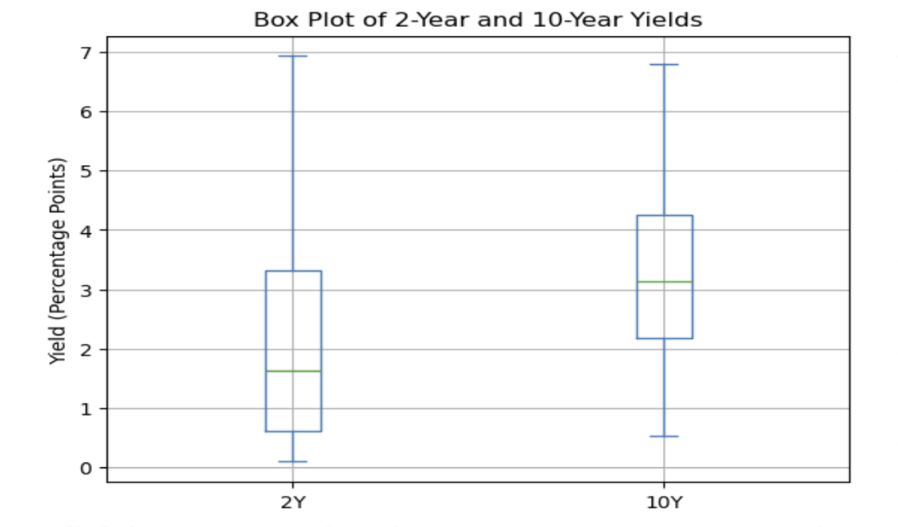

# Yield Curve Analysis and Its Impact on S&P 500 and Real Estate Markets

## Overview
This project explores the relationship between the yield curve (specifically the spread between 2-year and 10-year Treasury bond yields), the S&P 500 Index, and the Case-Shiller Home Price Index. We investigate how the un-inversion of the yield curve historically correlates with downturns in asset prices, including stock and housing markets.

## Hypothesis
We hypothesize that as the yield curve starts to un-invert, it historically signals a decrease in major asset classes such as the S&P 500 and real estate markets.

## Data Sources
- **Treasury Yields:** Federal Reserve Economic Data (FRED)
- **S&P 500 Index:** Yahoo Finance
- **Case-Shiller Home Price Index:** FRED

## Data Exploration and Cleanup
Our Jupyter Notebook details the data exploration and cleanup process:
- Resampling data to monthly frequency
- Calculating yield spread
- Normalizing data for comparative analysis
- Handling missing values and inconsistencies

## Analysis
The analysis includes:
- Time series plotting
- Correlation analysis between yield curve movements and asset class performance
- Statistical analysis to quantify relationships

## Key Findings
- Correlation between yield curve inversions and downturns in S&P 500 and real estate markets
- Periods post-yield curve un-inversion often mark asset price downturns

## Implications
These insights suggest that monitoring yield curve inversions can be crucial for predicting economic cycles and making informed investment decisions.

## Visualizations
Included are time series plots that illustrate the relationships between the yield curve, S&P 500, and real estate markets.
# Treasury Bond Yield Analysis

## Overview of Yield Spread Dynamics
One of the crucial aspects of financial analysis is understanding the behavior of treasury bond yields over time. In this section, we explore the variations between the two-year (2Y) and ten-year (10Y) treasury bonds.

### Trend Analysis
**Question:** How much difference has there been between the two and ten-year treasury bonds over time?

This question is addressed by analyzing the trend of yield spreads. The following visualizations represent the yield spread over time and a direct comparison of the 2Y and 10Y yields.

### Statistical Distribution of Yield Spread
**Question:** What has been the most common spread?

To answer this, we look at the distribution of yield spreads. The histograms and box plots below provide insights into the commonality and variance in the spreads.

### Correlation Analysis
**Question:** What is the frequency of the correlations?

Understanding the correlation between 2Y and 10Y yields is key. The scatter plot below provides a visual representation of this relationship.

### Smoothing the Data
**Question:** What does it look like if we smooth out the data?

Smoothing the data helps in identifying underlying trends. Below are the bar chart and line plot representing the average yields by year and moving averages of the yields.

## Predictive Analysis of Market Trends
An important aspect of this study is to assess how well the bond market predicts equity and real estate prices. We compare the yield spread with the S&P 500 Index and the Case-Shiller Home Price Index.

### Bond Market and S&P 500
**Question:** How well did the bond market predict equity prices?

The following graph illustrates the relationship between the yield spread and the S&P 500 Index.

### Bond Market and Real Estate Prices
**Question:** How well did the bond market predict real estate prices?

This is analyzed by comparing the yield spread with the Case-Shiller Home Price Index.

1. **What role does the yield curve play in financial forecasting?**
   - *Answer*: The yield curve helps predict economic growth. An upward slope often means expansion, while an inverted curve can signal a recession.

2. **Why is the spread between 2-year and 10-year Treasury bonds significant?**
   - *Answer*: This spread reflects investor expectations about the economy. A widening spread suggests optimism, while narrowing indicates potential economic downturns.

3. **Can the yield curve predict stock market trends?**
   - *Answer*: Yes, to an extent. For example, an inverted yield curve is often seen as a caution signal for the stock market, indicating potential downturns.

4. **How does an inverted yield curve relate to economic recessions?**
   - *Answer*: Historically, an inverted yield curve has been a precursor to recessions, signaling a potential economic slowdown.

5. **What factors influence the yield curve's shape?**
   - *Answer*: Inflation expectations, economic growth, and the Federal Reserve's policies are key influencers.

6. **How reliable is the yield curve as an economic indicator?**
   - *Answer*: It's not infallible, but it's a widely respected indicator that combines various market expectations.

7. **What insights can a student gain from studying the yield curve?**
   - *Answer*: It's a great way to understand market sentiments and economic forecasting, offering insights into investment strategies and risk management.

8. **As a student, how can I apply knowledge of the yield curve in real-world scenarios?**
   - *Answer*: Understanding the yield curve can aid in making informed decisions about investments, savings, and understanding the broader economic environment.

## Conclusion
This project highlights the predictive power of the yield curve on economic cycles and its impact on key asset classes. Our findings serve as a valuable tool for investors in managing portfolio risks and timing investment decisions.

## Storytelling Through Data
Our narrative weaves through the realms of economics and finance, revealing how abstract indicators like the yield curve can profoundly impact real-world asset markets. This journey through data uncovers the interconnectedness of economic indicators and investment risk, offering a roadmap for navigating the complexities of financial markets.
